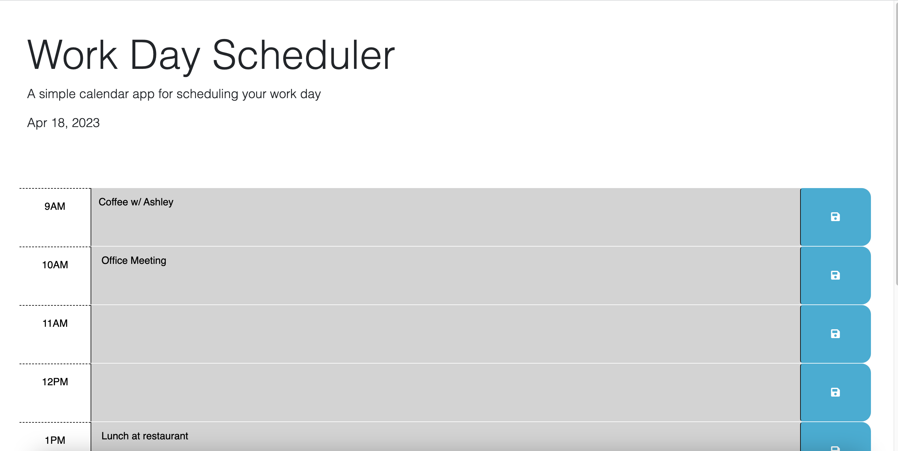

# Work Day Scheduler 

## Description 
 a simple calendar application that allows a user to save events for each hour of the day by modifying starter code. This app will run in the browser and feature dynamically updated HTML and CSS powered by jQuery.

## Table of Contents

 [Installation](#Installation)

    
 [License](#License)

    
 [Credits](#Credits)

 [ScreenShots](#ScreenShots)

    
 [Questions](#Questions)

## Installation
Just visit application at https://admarom.github.io/Workday-Scheduler/ to use application. Type in user-input and select save button. Data is saved to local storage on user's computer so when they bring up the page their data will be saved.

## Contributing
starter code: https://github.com/coding-boot-camp/crispy-octo-meme Github: ![GitHub] (https://github.com/Georgeyoo)

## ScreenShots

## Questions

Have questions? Email me at adenamarom@gmail.com or find me on ![GitHub] (https://github.com/AdMarom)!